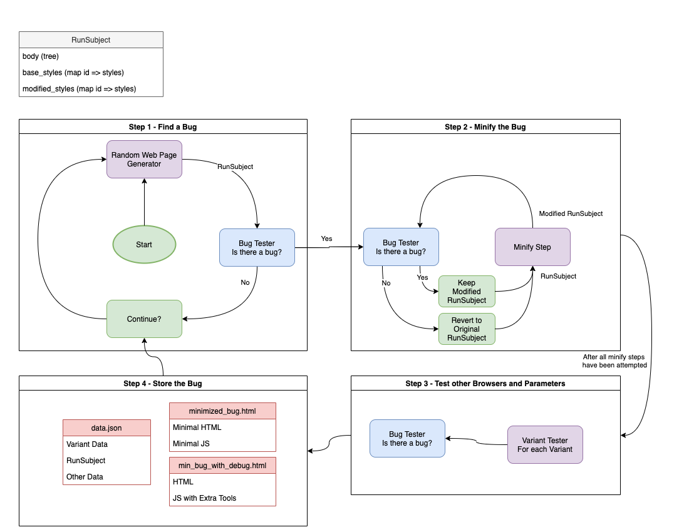

# Browser Layout Testing - QuickCheck

This is a tool that uses randomized testing to find under-invalidation
bugs in web browsers. It's already found a lot of bugs in Chrome
([1137427](https://bugs.chromium.org/p/chromium/issues/detail?id=1137427),
[1166887](https://bugs.chromium.org/p/chromium/issues/detail?id=1166887),
[1189755](https://bugs.chromium.org/p/chromium/issues/detail?id=1189755) [fixed],
[1189762](https://bugs.chromium.org/p/chromium/issues/detail?id=1189762),
[1190220](https://bugs.chromium.org/p/chromium/issues/detail?id=1190220) [fixed],
[1219641](https://bugs.chromium.org/p/chromium/issues/detail?id=1219641),
[1224721](https://bugs.chromium.org/p/chromium/issues/detail?id=1224721),
and
[1229681](https://bugs.chromium.org/p/chromium/issues/detail?id=1229681))
and Firefox
([1721719](https://bugzilla.mozilla.org/show_bug.cgi?id=1721719),
[1724991](https://bugzilla.mozilla.org/show_bug.cgi?id=1724991),
[1724982](https://bugzilla.mozilla.org/show_bug.cgi?id=1724982),
linked to metabug
[1724999](https://bugzilla.mozilla.org/show_bug.cgi?id=1724999)).
As of writing, sifting through bugs and preparing bug reports is the
most time-intensive part of this process.

# Running the Project
You can run the project in selenium. [See the docs here](docs/SELENIUM.md)
Or with Mozilla's Fuzzing Framework, Grizzly. [See the docs here](docs/GRIZZLY.md)

# Architecture Diagram

# Legal

Licensed for use through the [MIT License](MIT-LICENSE).

# More

For more, please go to [selenium](docs/SELENIUM.md) or [grizzly](docs/GRIZZLY.md).